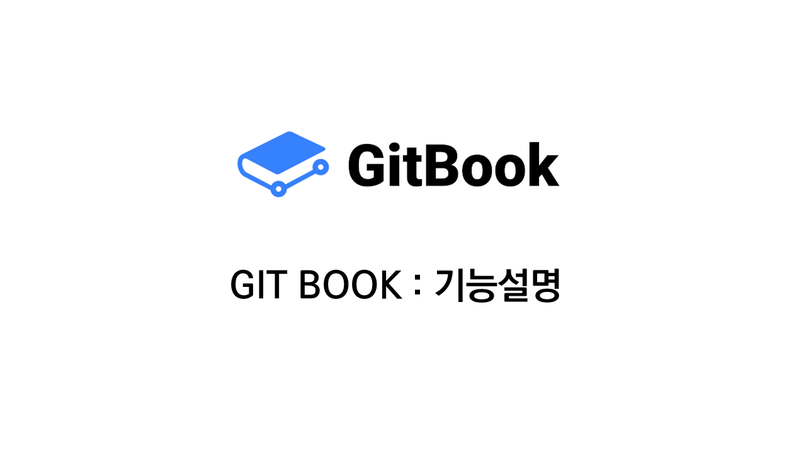
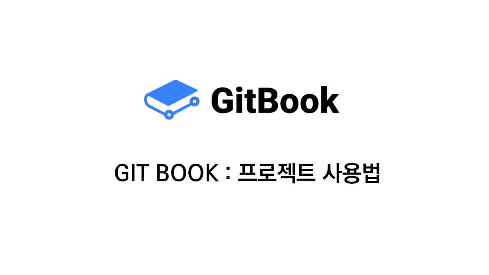
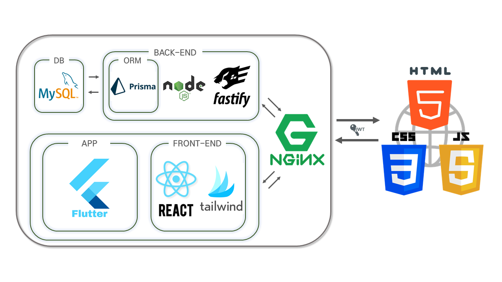

# MWMS - 국방물자관리체계

<br/>

<div align='center'>

/mwms/src/images/logo.png>)

---


<a href="https://github.com/osamhack2022-v2/WEB_APP_MWMS_RackVisor/blob/master/license.md"></a>

<a href="https://github.com/osamhack2022-v2/WEB_APP_MWMS_RackVisor/graphs/contributors"></a> <a href="https://github.com/osamhack2022-v2/WEB_APP_MWMS_RackVisor/stargazers"></a> <a href="https://github.com/osamhack2022-v2/WEB_APP_MWMS_RackVisor/network/members"></a> <a href="https://github.com/osamhack2022-v2/WEB_APP_MWMS_RackVisor/search?l=JavaScript&type=code"></a>

---

<a href=''></a> <a href=''></a> <a href=''></a>
<br/>

</div>

> 군인**의**, 군인을 **위한**, 군인에 **의한** <br/>&#160;&#160;&#160;&#160;&#160;&#160;&#160;&#160;&#160;&#160;&#160;&#160;&#160;&#160;&#160;&#160;&#160;&#160;&#160;&#160;&#160;&#160;&#160;&#160;&#160;&#160;&#160;&#160;&#160;&#160;&#160;&#160;&#160;&#160;&#160;&#160; 창고 관리 시스템, &#160;&#160; **"국방물자관리체계"**

---

## <br/> :book: 목차

  <ol>
    <li><a href="#introduction-project"> 프로젝트 소개 (Intro)</a></li>
    <li><a href="#introduction-function"> 기능설명 </a></li>
    <li><a href="#how-to-install"> 설치 안내 </a></li>
    <li><a href="#how-to-use"> 프로젝트 사용법 </a></li>
    <li><a href="#prerequisites"> 컴퓨터 구성 / 필수 조건 안내</a></li>
    <li><a href="#techniques"> 기술 스택</a></li>
    <li><a href="#team"> 팀 정보</a></li>
    <li><a href="#license"> 저작권 및 정보</a></li>
  </ol>

<br/>

---

<h2 id='introduction-project'> :books: 프로잭트 소개</h2>

<h4> :bulb: 배경 상황 </h4>

> 창고? 어땠냐고? 지옥 같았지...<br/>
> 창고 물자 관리를 어떻게 하냐고? 그냥 그때그때마다 세고 있어 <br/>
> 창고 항상 그거 난장판이야 그거 <br/>
> 혹시 XX 어디있는지 아십니까? 그거는 이제 창고 저어쪽 구석에 ... <br/>

군부대의 수많은 군수품들을 관리하는 창고, 각 창고는 모두 올바르게 관리되고 있을까요? <br/>
상급제대로부터 받은 군수품 혹은 필요할 때마다 그때그때 받은 모든 물품들은 창고에 저장되는데요 <br/>
그렇다면 저장된 물품들의 상태와 수량, 종류, 위치를 모두 정확하게 최신화 하고 있을까요? <br/>
수많은 부대에서 아직도 보급담당 계원들만 골머리를 앓는채 그대로 유지되는게 맞을까요? <br/>
더이상 그때그때 정리하고 보여주기를 위해서만 창고정리는 그만 <br/>
한번 정리하고 앞으로 쭉 관리하기 위한, **`국방물자관리체계`** <br/>
<br/>

<h4> :+1: 특징 </h4>

**`단순한 UI`**, 기능적으로 복잡하지 않고, 기존의 창고를 있는 그대로 본뜨기 위한 간단한 **`창고 관리`**<br/>
일괄 추가 일괄 제거, 그리고 세부적인 검색이 가능한 물자 관리<br/>
검색은 이젠 그만! **`QR 코드`** 를 통한 간편한 인식과 재고 확인<br/>
이거 벌써 유통기한 지났네? **`알람기능`** 을 통한 유통기한 임박 물품 리스트 확인<br/>
이걸 언제 다쓴거지? **`히스토리`** 확인과 **`통계`** 확인<br/>

<br/>

---

<h2 id="introduction-function"> :page_with_curl: 기능 설명</h2>

<a href="https://app.gitbook.com/o/Jw07u3aojPWZwNszVDiX/s/sEadZzLRcypJiDENQUQw/undefined-2/undefined"></a>
상단 GITBOOk을 클릭하여 자세한 정보를 확인할 수 있습니다.

<br/>

- 주요 기능 - **창고 관리** <br/>
  기존 부대의 각 창고의 모양을 본뜨기 위해서 간단한 UI 를 통해 창고의 모양을 본뜰 뿐더러, <br/> 창고 속 층과 구역을 간단히 나눠 그 누구든 검색한 위치로 쉽게 찾아갈 수 있도록 하는 기능 - **물자 관리** <br/>
  사용 가능 기한, 담당자 등을 바탕으로 하여 세부 특성에 맞춘 검색 기능<br>창고와 창고별 위치를 바탕으로 위치별 물자 검색<br>기존의 델리스 체계와의 호환을 위한 엑셀 맞춤형 물자 추가 - **바코드 생성과 인식** <br/>
  특정 물품에 가시성 있도록 하는 바코드를 부착한 간단한 관리<br>물자가 보관된 박스에 이를 조회하여 들어있어야 하는 물품을 조회하거나 혹은 박스 이름을 조회할 수 있도록 하는 기능 - **히스토리** <br/>
  부대 물품이 변동된 기록을 확인하여 사용처와 사용량을 확인할 수 있음 -**앱 제공**<br/>
  단순 웹사이트만 제공하는 체계들과 달리 휴대폰을 활용하여 창고에 직접 방문하여 물품의 리스트를 확인하고, QR 코드를 인식하여 조회할 수 있는 기능을 지니고 있음

<br/>

- 세부 기능 - **권한 설정**<br/>
  부대별 접속 가능한 권한을 설정하여 권한을 바탕으로 부대에 접근할 수 있도록 한다 - **알람과 공지사항 기능**<br/>
  부대에 속한 물품들이 유통기한이 임박했을 경우 이를 확인할 수 있음, 또한 부대 내 전파사항이 있을 경우 공지사항 게시판을 통해 서로에게 전파할 수 있음 - **통계 기능**<br/>
  특정 기간동안 사용된 물품의 수와 추가로 들어온 물품의 수를 비교하며, 특정 물품의 사용량을 확인하여 부대 운영 시 적절한 양의 물품을 받고 사용할 수 있도록 함

<br/>

---

<h2 id="how-to-install"> :wrench: 설치 안내 (Installation Process)</h2>

다른 서버쪽 앱쪽 나오는대로 앱 / 웹 만 나누고 나머지는 동시에 해서 보여주도록 하기

```bash
$ git clone git주소
$ yarn install
$ yarn start or npm run start
```

<br/>

---

<h2 id="how-to-use"> :mag_right: 프로젝트 사용법 (Getting Started)</h2>

<a href="https://app.gitbook.com/o/Jw07u3aojPWZwNszVDiX/s/sEadZzLRcypJiDENQUQw/undefined-3/undefined"></a>
상단 이미지를 클릭하여 `GIT-BOOK:프로젝트 사용법`으로 이동할 수 있습니다.

---

<h2 id="prerequisites">:computer: 컴퓨터 구성 / 필수 조건 안내 (Prerequisites)</h2>

<h4> :earth_asia: 브라우저 </h4>

- ECMAScript 6 지원 브라우저 사용
- 권장: Google Chrome 버젼 77 이상

<table width="900">

<thead>

<tr>

<th width="180" align="center"> Chrome</th>

<th width="240" align="center"> Internet Explorer</th>

<th width="180" align="center"> Edge</th>

<th width="180" align="center"> Safari</th>

<th width="180" align="center"> Firefox</th>

</tr>

</thead>

<tbody>

<tr>
<td align="center">YES</td>
<td align="center">11+</td>
<td align="center">YES</td>
<td align="center">YES</td>
<td align="center">YES</td>
</tr>

</table>

<br/>

---

<h2 id="techniques">:hammer: 기술 스택 (Technique Used)</h2>



### Server(back-end)

- **`Mysql`** 을 이용한 서버에 데이터 저장
  - [MySQL]("https://www.mysql.com/"): SQL 기반 DB 생성 및 이용
  - [Prisma]("https://www.prisma.io/"): Mysql 쿼리 생성 및 여러 DB 접근 기능 제공
    <br/>
- **`Fastify`** 를 이용한 REST API 작성 후 **`nodejs`** 로 실행
  - [Fastify]("https://www.fastify.io/"): TypeScript 이용한 REST API 작성
  - [NodeJs]("https://nodejs.org/ko/"): 작성된 BACKEND 코드 실행

### Front-end

- **`React`**, **`Tailwind`** 를 이용한 웹 프론트엔드 개발
  - [React]("https://ko.reactjs.org/"): JS 기반 웹 개발
  - [TailWind]("https://tailwindcss.com/"): CSS 프레임워크

### App

- **`Flutter`** 를 이용한 앱 개발
  - [Flutter]("https://flutter-ko.dev/"): 크로스 플랫폼 개발

<br/>

---

<h2 id="team">:runner: :runner: 팀 정보 (Team Information)</h2>

> **RackVisor** <br>가상 현실(VM) 속 창고(RACK) 을 다루는 프로그램(HYPERVISOR) 처럼 군대 속 창고들을 쉽게 다룰 수 있는 프로젝트를 만들기 위해 모인 팀입니다.

<br/>

<table width="900">

<thead>

<tr>

<th width="100" align="center">Name</th>

<th width="250" align="center">Role</th>

<th width="150" align="center">Github</th>

<th width="300" align="center">E-mail</th>

</tr>

</thead>

<tbody>

<tr>
<td width="100" height="55" align="center">제태호<br>(팀장)</td>
<td width="250">Product Manager<br>FrontEnd Developer</td>
<td width="150" align="center">
<a href="https://github.com/stpcoder">
</a>
<td width="300" align="center"><a href="mailto:thbrian@postech.ac.kr"></a></td>
</tr>

<tr>
<td width="100" height="55" align="center">조영현</td>
<td width="250">BackEnd Developer</td>
<td width="150" align="center">
<a href="https://github.com/poxios">
</a>
<td width="300" align="center"><a href="mailto:poxios0310@gmail.com"></a></td>
</tr>

<tr>
<td width="100" height="55" align="center">이현우</td>
<td width="250">BackEnd Developer</td>
<td width="150" align="center">
<a href="https://github.com/lhw414">
</a>
<td width="300" align="center"><a href="mailto:dlgusdn0414@snu.ac.kr"></a></td>
</tr>

<tr>
<td width="100" height="55" align="center">이원형</td>
<td width="250">App Developer</td>
<td width="150" align="center">
<a href="https://github.com/codingle2">
</a>
<td width="300" align="center"><a href="mailto:5292k@naver.com"></a></td>
</tr>

<tr>
<td width="100" height="55" align="center">여호영</td>
<td width="250">App Developer</td>
<td width="150" align="center">
<a href="https://github.com/YEOHOYEONG">
</a>
<td width="300" align="center"><a href="mailto:hoyeong3273@naver.com"></a></td>
</tr>

<tr>
<td width="100" height="55" align="center">정유환</td>
<td width="250">Designer</td>
<td width="150" align="center">
<a href="https://github.com/yh2369">
</a>
<td width="300" align="center"><a href="mailto:yuhwan012@gmail.com"></a></td>
</tr>

</table>

<br/>

---

<h2 id="license">저작권 및 사용권 정보 (Copyleft / End User License)</h2>

- [MIT](https://github.com/osam2020-WEB/Sample-ProjectName-TeamName/blob/master/license.md)

This project is licensed under the terms of the MIT license.

<br/>

---

<h2>더 자세한 정보...</h2>

더 자세한 정보는 [GIT-BOOK]()을 통해 확인하세요!
